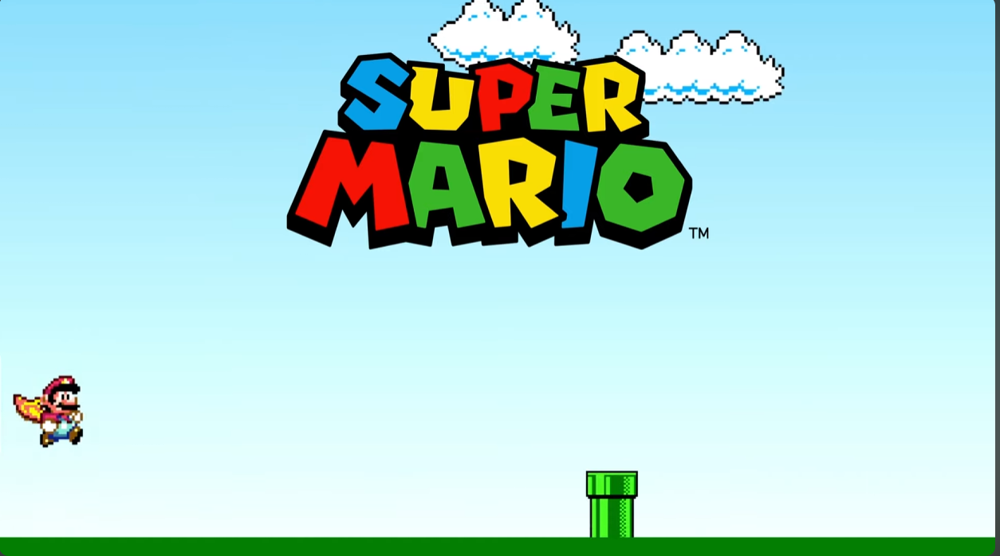

<h1 align="center"> Mario Game 🎮 </h1>

# Sobre o Game 🎮
Esse projeto foi feito para aperfeiçoar minhas habilidades 

# Apresentação 👀

  

# Tecnologias 💻
- HTML.
- CSS.
- JavaScript.

# Inspiração 💡

Projeto feito a partir de uma vídeo aula gratuita no YouTube, no canal LeehXD 📺. 
https://youtu.be/2_nbYVVoHR8?si=y7d04Y4LiuBW_RTQ

# Autor 

Paulo Cesar  
